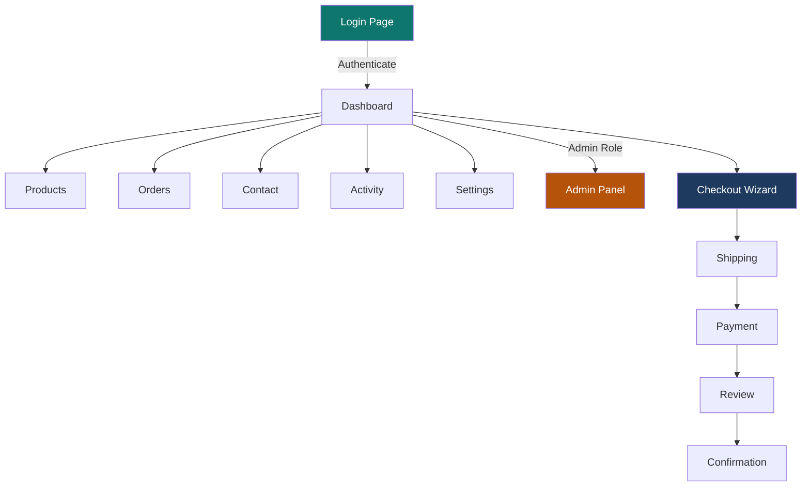

# Practice App Reference

The practice app is a purpose-built test target with 9 pages, 12 routes, and intentional bugs. Every exercise in the training platform targets this application.

## Overview



## Pages Overview

| Page | URL | Routes | Test Complexity |
|------|-----|--------|----------------|
| **Login** | `/login` | 1 | Beginner |
| **Dashboard** | `/dashboard` | 1 | Beginner |
| **Products** | `/products` | 1 | Beginner |
| **Contact** | `/contact` | 1 | Intermediate |
| **Orders** | `/orders` | 1 | Intermediate |
| **Checkout** | `/checkout/*` | 4 | Advanced |
| **Settings** | `/settings` | 1 | Intermediate |
| **Admin** | `/admin` | 1 | Advanced |
| **Activity** | `/activity` | 1 | Intermediate |

### Login Page

**URL:** `/login`
**Purpose:** Authentication testing, form validation, account lockout
**Test Credentials:**

| Email | Password | Role | Notes |
|-------|----------|------|-------|
| `user@test.com` | `Password123!` | Editor | Standard user |
| `admin@test.com` | `AdminPass1!` | Admin | Admin panel access |
| `locktest@test.com` | `LockPass123!` | Viewer | For lockout testing (5 failures) |

**Key Test IDs:**
- `email-input` — Email field
- `password-input` — Password field
- `login-button` — Submit button
- `error-message` — Validation errors

**What to Test:**
- ✅ Successful login → redirect to dashboard
- ✅ Invalid email format shows error
- ✅ Wrong password shows "Invalid credentials"
- ✅ Account locks after 5 failed attempts
- ✅ Empty form validation

### Dashboard Page

**URL:** `/dashboard`
**Purpose:** Post-login landing, navigation hub, visual regression target
**Requires:** Authenticated user

**Key Test IDs:**
- `dashboard-heading` — Main heading
- `dashboard-welcome` — Welcome message
- `nav-link-products`, `nav-link-orders`, etc. — Navigation links

**What to Test:**
- ✅ Page loads after successful login
- ✅ Welcome message displays user email
- ✅ Navigation links are present and clickable
- ✅ Visual regression (screenshot comparison)

### Products Page

**URL:** `/products`
**Purpose:** Search, filtering, empty states
**Requires:** Authentication

**Key Test IDs:**
- `search-input` — Search box
- `category-filter` — Category dropdown
- `product-card` — Individual product cards
- `result-count` — Number of results
- `empty-state` — No results message

**What to Test:**
- ✅ Search filters results correctly
- ✅ Category filter works
- ✅ Result count matches displayed items
- ✅ Empty state appears for no results
- ✅ Combining search + filter

### Contact Page

**URL:** `/contact`
**Purpose:** Form validation with required/optional fields
**Requires:** Authentication

**Key Test IDs:**
- `name-input` — Name field (required)
- `email-input` — Email field (required)
- `phone-input` — Phone field (optional)
- `message-input` — Message textarea (required)
- `submit-button` — Form submission
- `success-message` — Success confirmation

**What to Test:**
- ✅ Required field validation
- ✅ Email format validation
- ✅ Phone format validation (optional field)
- ✅ Success message after submission
- ✅ Form clears after success

### Orders Page

**URL:** `/orders`
**Purpose:** Data table testing, sorting, filtering, pagination
**Requires:** Authentication

**Key Test IDs:**
- `order-row` — Table rows
- `sort-date`, `sort-amount`, `sort-status` — Sort buttons
- `status-filter` — Status dropdown
- `pagination-next`, `pagination-prev` — Pagination controls
- `page-info` — Current page indicator

**What to Test:**
- ✅ Table displays order data
- ✅ Sorting by date, amount, status
- ✅ Filtering by order status
- ✅ Pagination navigation
- ✅ Result count per page

### Checkout Wizard

**URLs:** `/checkout/shipping`, `/checkout/payment`, `/checkout/review`, `/checkout/confirmation`
**Purpose:** Multi-step workflow, data persistence, navigation
**Requires:** Authentication

**Key Test IDs (Shipping):**
- `shipping-name`, `shipping-address`, `shipping-city`, `shipping-zip`
- `shipping-next` — Continue button

**Key Test IDs (Payment):**
- `card-number`, `card-expiry`, `card-cvv`, `card-name`
- `payment-back`, `payment-next`

**Key Test IDs (Review):**
- `review-shipping-info`, `review-payment-info`
- `review-back`, `place-order-button`

**Key Test IDs (Confirmation):**
- `order-number`, `confirmation-message`

**What to Test:**
- ✅ Forward navigation through steps
- ✅ Back button preserves data
- ✅ Data appears correctly in review step
- ✅ Order confirmation displays
- ✅ Context state management

### Settings Page

**URL:** `/settings`
**Purpose:** Tabbed interface, form updates, **accessibility violations**
**Requires:** Authentication

**Key Test IDs:**
- `tab-profile`, `tab-notifications`, `tab-preferences` — Tab buttons
- `profile-name`, `profile-email` — Profile fields
- `notification-toggle-email`, `notification-toggle-sms` — Toggles
- `save-button` — Save changes

**What to Test:**
- ✅ Tab navigation
- ✅ Profile updates persist
- ✅ Notification toggles work
- ✅ **Accessibility violations** (3 intentional WCAG failures)

### Admin Panel

**URL:** `/admin`
**Purpose:** Role-based access, user management, bulk operations, **stale state bugs**
**Requires:** Admin role (`admin@test.com`)

**Key Test IDs:**
- `user-row` — User table rows
- `user-search` — Search input
- `select-all-checkbox` — Bulk select
- `bulk-action-dropdown` — Bulk actions
- `apply-bulk-action` — Apply button

**What to Test:**
- ✅ Non-admin users see access denied
- ✅ User search works
- ✅ Bulk selection
- ✅ Bulk actions execute
- ✅ **Stale state bug** after bulk operations

### Activity Page

**URL:** `/activity`
**Purpose:** Filterable feed, detail views, async content, **mock modes**
**Requires:** Authentication

**Key Test IDs:**
- `activity-item` — Feed items
- `filter-all`, `filter-comments`, `filter-likes` — Filter buttons
- `activity-detail` — Detail view
- `mock-mode-selector` — Error simulation dropdown

**What to Test:**
- ✅ Feed loads asynchronously
- ✅ Filters work correctly
- ✅ Detail view navigation
- ✅ **Mock error modes** (error, timeout, stale)

## Intentional Bugs

The practice app contains deliberate bugs for learners to discover through testing:

::: danger Not Real Bugs
These are **curriculum features**, not defects. Do not fix them — they are the test targets.
:::

### Known Issues by Page

- **Settings** — 3 intentional accessibility violations (WCAG contrast, missing labels, keyboard traps)
- **Admin** — Stale state after bulk operations; search doesn't clear on navigation
- **Activity** — Mock modes that simulate error states, timeouts, and stale data
- **Toast notifications** — 3 race conditions in the ToastContext provider

### Testing Patterns

Each page exercises specific Playwright patterns:

| Pattern | Pages | Skills Practiced |
|---------|-------|-----------------|
| Form interactions | Login, Contact, Settings | `fill()`, `click()`, `toHaveValue()` |
| Navigation & routing | Checkout (4 steps) | `goto()`, `waitForURL()`, `toHaveURL()` |
| Table operations | Orders, Admin | `locator().nth()`, sorting assertions |
| Search & filter | Products, Activity | Input events, result count assertions |
| Authentication | Login → Dashboard | Auth state, role-based access |
| Multi-step workflows | Checkout wizard | Context preservation, back/forward nav |

## Architecture

```text
practice-app/
├── src/
│   ├── pages/           ← 9 page components (intentionally buggy)
│   ├── contexts/        ← 3 context providers
│   │   ├── AuthContext   → Role-based auth (admin/editor/viewer)
│   │   ├── CheckoutContext → Multi-step checkout state
│   │   └── ToastContext  → Notifications with race conditions
│   ├── components/      ← Shared UI components
│   └── App.tsx          ← Router with 12 routes
├── e2e/                 ← Placeholder for learner tests
├── playwright.config.ts ← Pre-configured for the practice app
└── public/              ← Static assets
```

## data-testid Attributes

Every interactive element has a `data-testid` attribute for stable selectors:

```typescript
// Example: targeting the login form
await page.getByTestId('email-input').fill('user@test.com');
await page.getByTestId('password-input').fill('Password123!');
await page.getByTestId('login-button').click();
```

This convention teaches learners to use stable selectors from the start, rather than relying on CSS classes or text content that may change.

## Running Locally

```bash
cd practice-app
pnpm install
pnpm dev
# → http://localhost:5173
```

The app runs on port 5173 by default. The training app's practice links point to this URL.
