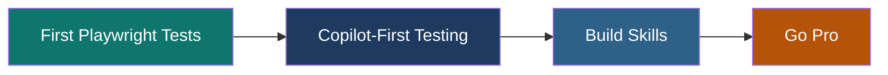

---
# https://vitepress.dev/reference/default-theme-home-page
layout: home

hero:
  name: Midnight Automation Voyage
  text: Playwright + GitHub Copilot Training Platform
  tagline: Interactive courses teaching manual testers to write automated tests — from first click to CI/CD pipeline. Built for QA engineers who know how to test but are new to code.
  actions:
    - theme: brand
      text: Get Started →
      link: /guide/getting-started
    - theme: alt
      text: Browse Courses
      link: /courses/
    - theme: alt
      text: View on GitHub
      link: https://github.com/tafreeman/midnight-automation-voyage

features:
  - icon: 🎭
    title: Real Playwright Tests
    details: Every exercise targets a live practice app with 9 pages, 12 routes, and intentional bugs. Write real tests against real UI — no mock data, no external dependencies.
  - icon: 🤖
    title: Copilot-First Workflow
    details: Learn to prompt GitHub Copilot for useful test drafts, then refine them into production-quality specs. Master the AI-assisted testing workflow from day one.
  - icon: 📚
    title: 55+ Interactive Modules
    details: Two standalone courses (22 modules) plus legacy curriculum (33 modules) — beginner to advanced, ~9 hours of structured content with quizzes and exercises.
  - icon: 🧪
    title: Practice App Included
    details: Purpose-built test target with login, search, checkout wizard, admin panels, and data-testid attributes throughout. Nine pages designed for learning automation.
  - icon: 🎯
    title: Quizzes & Exercises
    details: Each module includes knowledge checks, hands-on coding exercises, and prompt templates you can copy directly into GitHub Copilot for instant test generation.
  - icon: 🚀
    title: Zero to CI/CD
    details: Progress from writing your first locator to running tests in GitHub Actions with parallel sharding. Complete learning path from beginner to enterprise-ready automation.
---

## Featured Courses

<CourseCard
  title="First Playwright Tests"
  level="beginner"
  :modules="10"
  status="Complete"
  description="The recommended starting point. Each lesson builds on the previous — from watching a test run to building your own test pack."
  link="/midnight-automation-voyage/courses/first-playwright-tests"
  :moduleList="[
    'See a Test Do Real Work',
    'Just Enough TypeScript',
    'Set Up the Workbench',
    'Run Tests from VS Code',
    'Read a Test Like Evidence',
    'Find the Right Element',
    'Ask Copilot for a Draft',
    'Record a Login Flow',
    'Tighten the Recording',
    'Build Your First Test Pack'
  ]"
/>

<CourseCard
  title="Copilot-First Testing"
  level="intermediate"
  :modules="10"
  status="Complete"
  description="Master the prompt-driven workflow — learn to get useful test code from Copilot and refine it into reliable automation."
  link="/midnight-automation-voyage/courses/copilot-first-testing"
  :moduleList="[
    'How Automation Works',
    'Environment Setup',
    'Test Structure',
    'Selectors & Locators',
    'What to Automate',
    'Your Testing Toolkit',
    'Record & Refine',
    'Writing Tests',
    'Page Object Model',
    'API Testing'
  ]"
/>

## Why Midnight Automation Voyage?

Most Playwright tutorials assume you already know JavaScript and testing concepts. **Midnight Automation Voyage** is built for manual testers who are excellent at finding bugs but new to writing code.

Every lesson starts with *what you already know* (acceptance criteria, test plans, domain knowledge) and shows how to translate that into automation — with GitHub Copilot doing the heavy lifting on syntax.

### What Makes It Different

| Feature | Midnight Automation Voyage | Typical Tutorial |
|---------|---------------------------|-----------------|
| **Target audience** | Manual QA testers transitioning to automation | Developers with coding experience |
| **Starting point** | Acceptance criteria and test plans | Code editor and frameworks |
| **AI integration** | Copilot-first workflow from day one | Afterthought or not mentioned |
| **Practice environment** | Dedicated app with intentional bugs | External sites or no practice target |
| **Assessment** | Quizzes + exercises + prompt templates | None or minimal |
| **Progression** | Structured 4-tier curriculum | Random topics |
| **Code examples** | 59 reference tests included | Copy-paste snippets |

## Quick Feature Spotlight

<FeatureGrid />

## Learning Path

**Beginner (Course 1)** → Record, refine, and run your first tests
**Intermediate (Courses 2-3)** → Master selectors, page objects, and CI/CD
**Advanced (Course 4)** → Trace viewer, accessibility, performance testing

## What You'll Build

By the end of the curriculum, you'll have:

- ✅ **Test packs for 9 application pages** — login, search, checkout, admin, and more
- ✅ **CI/CD pipeline** running tests in GitHub Actions with parallel sharding
- ✅ **Page object models** organizing reusable test code
- ✅ **API test integration** validating backend responses
- ✅ **Accessibility tests** catching WCAG violations automatically
- ✅ **Visual regression suite** detecting unintended UI changes
- ✅ **Prompt template library** for generating tests with Copilot

## Built for Teams

### One-Week Onboarding Plan

Perfect for teams transitioning manual testers to automation:

| Day | Focus | Outcome |
|-----|-------|---------|
| **Monday** | Environment setup, first test run | Developer tools installed, first test executed |
| **Tuesday** | Test structure and selectors | Can read and understand test code |
| **Wednesday** | Copilot prompts and recording | Generated first test with AI assistance |
| **Thursday** | Refinement and assertions | Tests have proper validation |
| **Friday** | Test pack building | Complete test suite for one feature |

### Evaluating Learner Progress

The platform includes 59 reference tests in `test-cases/examples/` for comparison. Quality criteria:

- ✅ Independent tests (no dependencies between specs)
- ✅ Real assertions (`expect()` validates acceptance criteria)
- ✅ Stable selectors (`data-testid`, not CSS classes)
- ✅ No arbitrary waits (`waitForTimeout`)
- ✅ Descriptive test names that explain behavior

## Technology Stack

| Component | Technology | Purpose |
|-----------|-----------|---------|
| Testing Framework | Playwright 1.58+ | Cross-browser automation |
| AI Assistant | GitHub Copilot | Test code generation |
| Training Platform | React + Vite + TypeScript | Interactive learning app |
| Practice App | React Router + Context API | Real test target |
| Styling | Tailwind CSS | Consistent UI |
| Documentation | VitePress | This site |

## Ready to Start?

  <a href="/guide/getting-started" class="vp-button vp-button-brand">Get Started →</a>
  <a href="/courses/" class="vp-button vp-button-alt" style="margin-left: 1rem;">Browse Courses</a>

